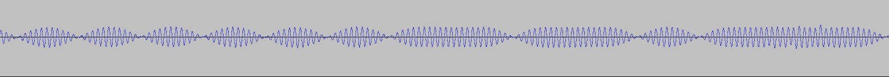
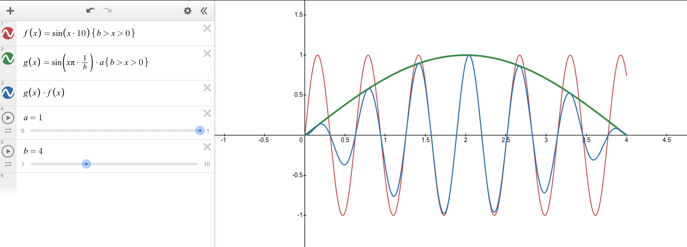

# PSK Envelope Filter

This filter will take a PSK signal and apply a multiplier to it's samples where there is a phase shift.

[https://www.desmos.com/calculator/p2ilbwhqfx](https://www.desmos.com/calculator/nfqre8t6dx)

https://dsp.stackexchange.com/questions/70411/use-of-pulse-shaping-in-digital-modulation
